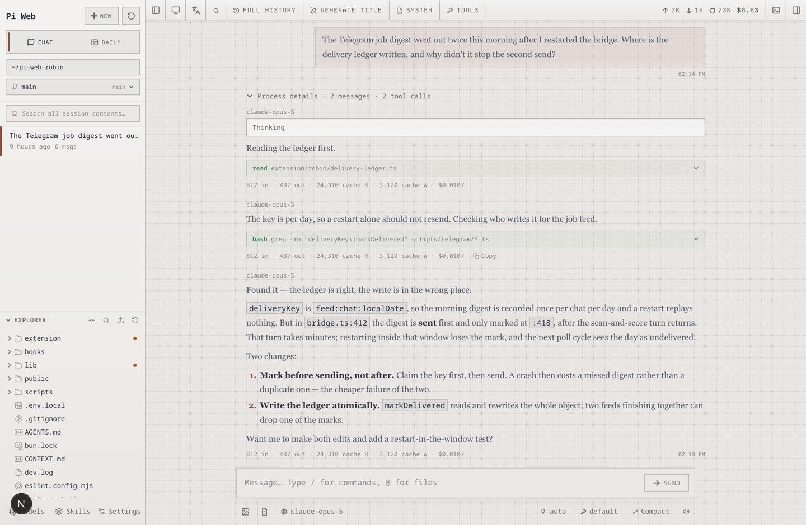
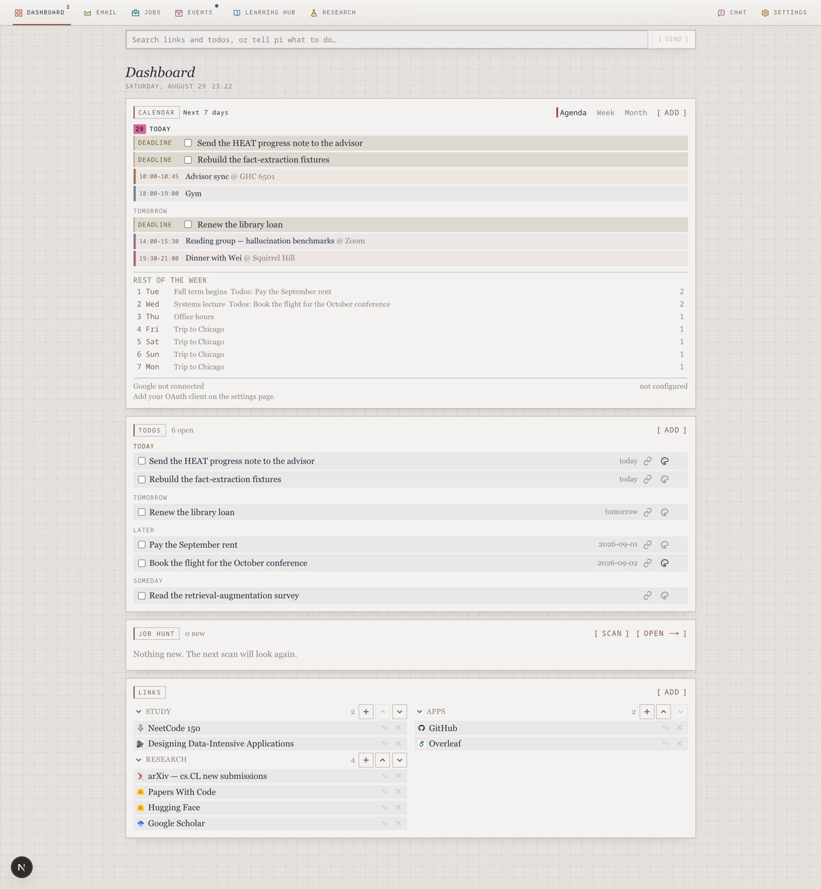
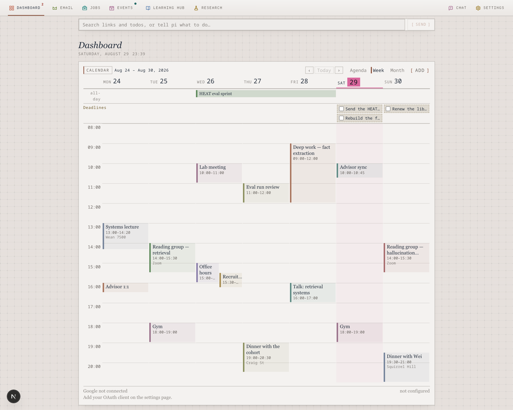
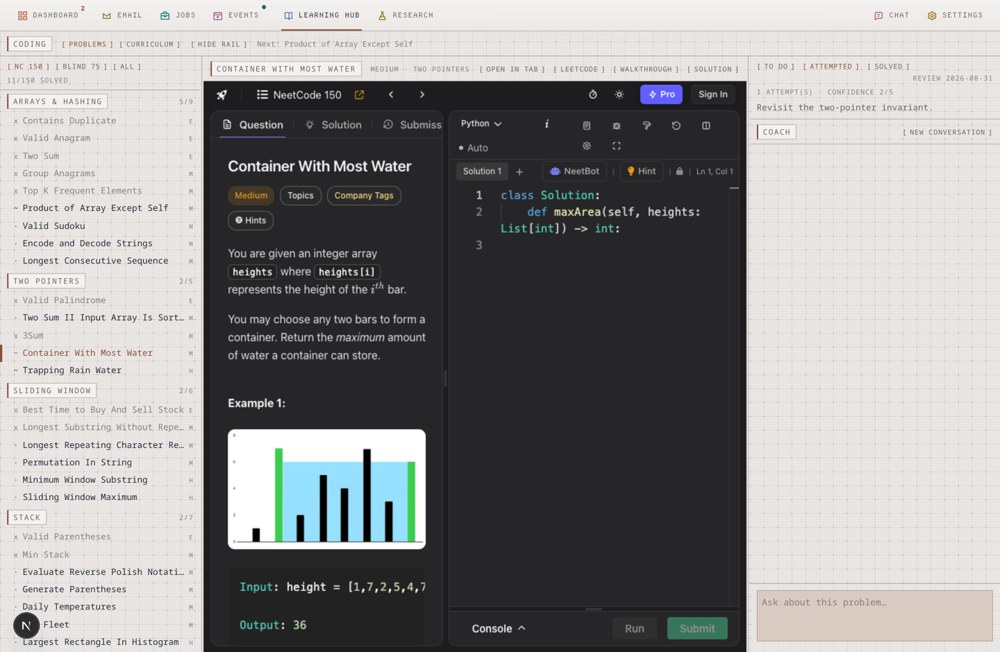

# Pi Web · Robin

Robin docs: [English](./extension/robin/README.md) | [中文](./extension/robin/README.zh-CN.md)

A fork of [agegr/pi-web](https://github.com/agegr/pi-web), the local browser UI for the
[pi coding agent](https://github.com/earendil-works/pi). Everything upstream does is still
here and unchanged: browse and resume sessions, run agent turns, branch a conversation,
inspect project files and Git diffs, switch worktrees, and configure models and skills from
the browser.



That side is upstream's and stays as it is — sessions grouped by project, expandable tool
calls, per-turn token and cost accounting, the file explorer, and the model picker.

What this fork adds is **Robin** — a personal workspace that lives beside the chat window and
is driven by the same pi agent, but through a **fixed tool allow-list instead of a shell**.
Todos and a calendar, read-only mail, a job hunt, a coding curriculum with a coach, a research
desk, and a Telegram bridge so the same assistant answers when you are away from the machine.



The assistant box at the top is the whole surface: type a sentence, the agent acts, and the
panels below refresh. The line under each reply ("added a todo") comes from the tool calls that
actually executed, not from the model's prose.



The calendar has three views and remembers the one you left it on. The week grid keeps an
all-day band and a deadlines row above the time grid, gives overlapping events a share of the
day's width, and is sized to its own content — 07:00–22:00 by default, widening to cover
whatever is actually on the week — so it never traps the page's scroll.

## The pages this fork adds

| Page | What it is |
| --- | --- |
| `/dashboard` | Assistant box, calendar (agenda / week / month), todos grouped by when they are due, the job-hunt summary, and saved links grouped into families. |
| `/dashboard/gmail` | Read-only Gmail. Not a message list but a categorised answer to "what came in today and what needs me" — the review turn files mail into buckets and creates a calendar event for appointments, a todo for deadlines. |
| `/dashboard/jobs` | The job hunt: scan configured boards and an ATS directory, score each posting against a CV and a rubric, then shortlist / apply / drop. Twice-daily digests go to Telegram with triage buttons. |
| `/dashboard/events` | AI and software-engineering events in the Bay Area, scanned weekly from public feeds and filterable by topic. |
| `/learn` | Learning Hub — the front door: a way into each track, where you already are in it, and the shelf of study links. |
| `/learn/map` | Capability atlas — a progressive world model of software and AI engineering: six foundations, an AI extension, what each capability is for, and how it is acquired. Roles recolour the tree; they never filter it. |
| `/coding` | Two tracks. **Problems** embeds the NeetCode roadmap next to a coach that hints instead of answering. **Curriculum** opens a syllabus running from JavaScript to system design next to a mentor that explains and ties every answer back to what the module is for. |
| `/research` | The HEAT hallucination-detection project: the stack of terms, models, datasets and metrics it runs on, a takeover report at `/research/report`, a line-by-line walkthrough of its single source file at `/research/code`, and a takeover brief at `/research/brief`. |
| `/dashboard/settings` | Google and Telegram credentials, digests, and push schedules. Stored in `~/.pi/robin/secrets.json` at mode `0600`; the page never shows a stored secret back. |



The middle pane is NeetCode's own problem page, editor and judge included, so a problem is
solved without leaving the workspace. A cross-origin frame reports nothing back, so clicking a
problem in the rail is not decoration — it is what tells the server which problem is open, and
that record is the only reason the coach on the right can answer a question about "this one".
The coach climbs a hint ladder (what did you try → the pattern → the invariant → the algorithm →
code only if you ask) and records how far up it went, because a solve that needed four hints
should come back sooner than one that needed none. Every seam resizes and remembers its width.

## What is deliberately different

- **The agent's hands are tied.** The Robin sessions activate only their tool allow-list; pi's
  `bash`, `read`, `write`, and `edit` stay inactive. That is a tool-registration boundary, not a
  line in a prompt.
- **No delete tools.** Removing a todo, an event, or a link is a click on the page. Remote
  deletion is a risk that buys little.
- **Google is read-only.** Calendar and Gmail can be shown, never written. Pulled events and
  messages are fetched per request and never copied into the local store, so disconnecting
  removes them immediately.
- **Mail is untrusted input.** The tool prompts tell the model to extract facts from a message
  and never to follow instructions found inside one.
- **Your data is plain JSON** under `~/.pi/robin` (`todos.json`, `events.json`, `links.json`,
  `practice.json`, …). `grep` it, back it up, put it in git. The two credential files are the
  exception and are written at mode `0600`.
- **The pages are documents, not an admin panel.** Italic serif titles, tracked mono chrome,
  square hairlined panels and bracket buttons on the engineering-pad ground — a page margin
  beside the text rather than an app sidebar. See [docs/pi-visual-language.md](./docs/pi-visual-language.md).
- **English, Simplified Chinese, and Traditional Chinese**, including date formatting; the
  switcher in the top bar drives Robin's pages too.

Beyond Robin's own pages, the fork also adds a **subscription usage panel** to the Models
config — the OpenAI Codex and Anthropic quota windows already managed by pi, as percentages and
reset times, never tokens.

## Running this fork

This fork is not published to npm; `npx @agegr/pi-web` installs **upstream**. Run it from source:

```bash
git clone https://github.com/bruceche-cmu-F25/pi-web-robin.git
cd pi-web-robin
npm install
npm run dev
```

Then open <http://127.0.0.1:30141/dashboard>, or use the grid icon in the sidebar header next to
**+ New**. Node.js 22.19.0 or newer is required.

For the agent tools to exist in the `pi` CLI as well as in Pi Web, symlink the extension into
pi's extension directory:

```bash
ln -sfn "$PWD/extension/robin" ~/.pi/agent/extensions/robin
```

No build step — jiti imports the TypeScript directly. Editing anything under `extension/robin`
needs a restart of Pi Web or the CLI, because extensions are loaded when a session starts;
components under `components/robin` hot-reload normally.

Google and Telegram are optional and are configured at **/dashboard/settings**, not in
`.env.local`. The Telegram bridge is a separate process:

```bash
npm run telegram
```

Full setup, the tool table, the Telegram command and button vocabulary, the data files, and the
module boundaries: [extension/robin/README.md](./extension/robin/README.md)
([中文](./extension/robin/README.zh-CN.md)).

## Configuration

For port and hostname, command-line options override the corresponding environment variables. Either `--no-open` or `PI_WEB_NO_OPEN=1` disables automatic browser opening. Run `pi-web --help` (or `-h`) to print startup options and exit without starting the server. Unknown options exit with an error.

| Option or environment variable | Purpose | Default |
| --- | --- | --- |
| `--help`, `-h` | Print startup options and exit | — |
| `--port <port>`, `-p <port>`, or `PORT` | Server port | `30141` |
| `--hostname <host>`, `-H <host>`, or `PI_WEB_HOSTNAME` | Bind hostname | `127.0.0.1` |
| `--no-open` or `PI_WEB_NO_OPEN=1` | Do not open a browser automatically | Browser opens |
| `PI_WEB_SKIP_VERSION_CHECK=1` | Disable Pi Web update checks | Unset |
| `PI_WEB_ALLOWED_HOSTS` | Additional exact proxy or custom hostnames, comma-separated | Unset |
| `PI_WEB_PASSWORD` | Enable HTTP Basic Auth; the username is always `pi` | Authentication disabled |
| `ROBIN_DATA_DIR` | Where Robin keeps its JSON files | `~/.pi/robin` |

For example:

```bash
npm run dev -- -p 8080 -H 0.0.0.0 --no-open
```

### Remote Access

Binding to a non-loopback address exposes an agent that can execute high-privilege actions. On a trusted LAN, require a long random password:

```bash
PI_WEB_PASSWORD='a-long-random-password' npm run dev -- --hostname 0.0.0.0
```

Basic Auth does not encrypt the password in transit. Do not expose Pi Web over plain HTTP to the internet; use HTTPS through a trusted reverse proxy or a trusted VPN. If a reverse proxy sends an external hostname, add that exact name to `PI_WEB_ALLOWED_HOSTS`. This allow-list does not change the address Pi Web binds to.

### Interactive terminal

A session can open an interactive terminal tab in its working directory. Because this grants the browser the same filesystem and command privileges as the Pi Web process, terminal routes are intentionally stricter than the rest of the app: they require `PI_WEB_PASSWORD`, accept loopback requests only, and cannot be enabled over LAN or a reverse proxy. Closing the terminal tab terminates its shell; hiding the right panel does not.

Only the terminal you are looking at holds a live connection — browsers allow just six concurrent streams per origin, so a backgrounded terminal drops its stream and catches up on the buffered output when you return to it. A shell nobody is watching is reaped after 15 minutes; one you have open is never reaped, however long it sits quiet.

The shell starts from a deliberately small environment (no `~/.bashrc`, no `~/.profile`), so `nvm`, `pyenv` and shell aliases are not available in it; `PATH`, `HOME` and `SSH_AUTH_SOCK` are inherited so that `git` over SSH works. Terminals depend on `node-pty`, an optional native package: if your platform has no prebuild and no compiler, the rest of Pi Web still runs and the terminal button reports why it is unavailable.

The shell starts without user startup files and receives a reduced environment, but it is not an OS sandbox. Commands entered in it still have the permissions of the user running Pi Web.

### HTTP Proxy

Server-side model and API requests honor the standard `HTTP_PROXY`, `HTTPS_PROXY`, and `NO_PROXY` environment variables.

```bash
HTTP_PROXY=http://127.0.0.1:7890 \
HTTPS_PROXY=http://127.0.0.1:7890 \
NO_PROXY=localhost,127.0.0.1 \
npm run dev
```

## Notes

- **Agent data**: Pi Web reads pi data from `~/.pi/agent` by default, including session files under `sessions/<encoded-cwd>/<timestamp>_<uuid>.jsonl`. Set `PI_CODING_AGENT_DIR` to use another pi agent directory.
- **Filesystem access**: Pi Web must be able to read the agent data directory and the working directories recorded by its sessions. Run Pi Web in the same filesystem environment as pi when sharing existing sessions.
- **Shared configuration**: the Models panel uses pi's model, settings, and credential storage, so changes are visible to both interfaces.
- **File access boundary**: the file browser is limited to working directories selected in Pi Web and project or session roots it already knows about; it is not a general filesystem browser.
- **Git worktrees**: see [Worktrees in Pi Web](./docs/worktrees.md) for switcher visibility, worktree creation, and removal behavior.

### Downstream Session Context Menu

Electron wrappers and other downstream integrations can provide a session-row
context menu without patching `SessionSidebar`. Listen for the cancelable
`pi-web:session-row-contextmenu` browser event and call `preventDefault()`
synchronously when the integration will handle it:

```js
window.addEventListener("pi-web:session-row-contextmenu", (event) => {
  event.preventDefault();
  const { id, path, cwd, name, clientX, clientY, refresh } = event.detail;

  void openSessionMenu({ id, path, cwd, name, clientX, clientY }).then((changed) => {
    if (changed) refresh();
  });
});
```

The detail object contains `id`, `path`, `cwd`, optional `name`, pointer
coordinates, and a `refresh()` callback for actions that change the session
list. If no listener cancels the extension event, Pi Web preserves the
browser's native context menu. This hook is browser-side and independent of
Pi agent extensions.

## Development

```bash
npm install
npm run dev
```

The development server runs at [http://127.0.0.1:30141](http://127.0.0.1:30141). Run the common checks with:

```bash
npm test
node_modules/.bin/tsc --noEmit
npm run lint
```

Do not run `next build` or `npm run build` during normal development. It writes to `.next/` and can interfere with the development server; leave builds for release work.

Contributor guides: [Internationalization](./docs/i18n.md), [Release process](./docs/release.md), and the [visual language](./docs/pi-visual-language.md).

## Repository Layout

```text
app/               Next.js UI and API routes
components/        React UI components
hooks/             Client state and interaction hooks
lib/               Session, agent, model, file, Git, and security logic
public/            Static assets and PWA files
bin/               npm CLI entrypoint and launch option parsing
docs/              Focused user and contributor guides

extension/robin/   Robin's pi extension: agent tools, domains, and stores
components/robin/  Robin's UI
app/dashboard/     Dashboard, email, jobs, events, settings
app/learn/         Learning Hub and the capability atlas
app/coding/        Practice and curriculum workspaces
app/research/      HEAT research desk
app/api/robin/     Robin API routes
scripts/telegram/  Telegram bridge
```

See [AGENTS.md](./AGENTS.md) for architecture notes and a detailed file map.

## Relation to upstream

Robin is almost entirely additive: new directories rather than rewrites, plus a short list of
touched upstream files (the sidebar link, the message catalogues, the OAuth callback exemption,
and build configuration) — enumerated at the end of
[extension/robin/README.md](./extension/robin/README.md#changes-to-upstream-pi-web). Upstream is
tracked as the `upstream` remote and merged in periodically.

Upstream's own [中文](./README.zh-CN.md), [日本語](./README.ja.md), and [Русский](./README.ru.md)
READMEs are kept as they came and describe Pi Web without Robin.

## License

[MIT](./LICENSE)
